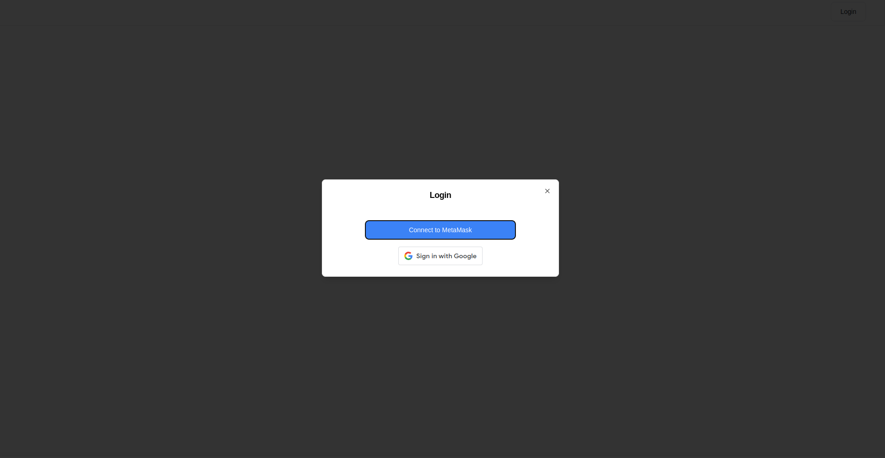
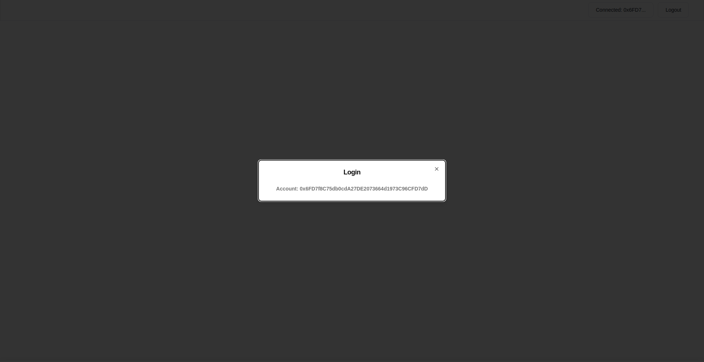

## Ultimate Todo

- [x] User should be able to login/register in the System either using Google or Anonymously
- [ ] User should be able to create content and share with the community
- [ ] User can also keep their content private and can expose the content based on approval request or subscription based model

## Images

